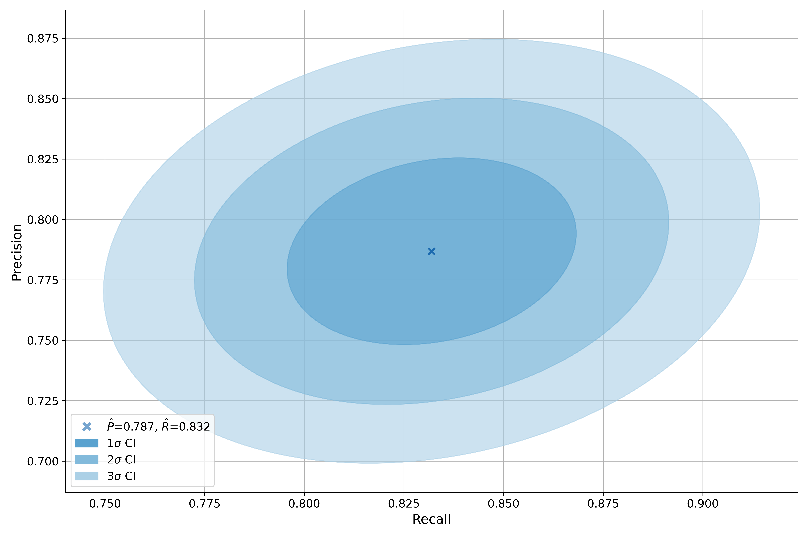
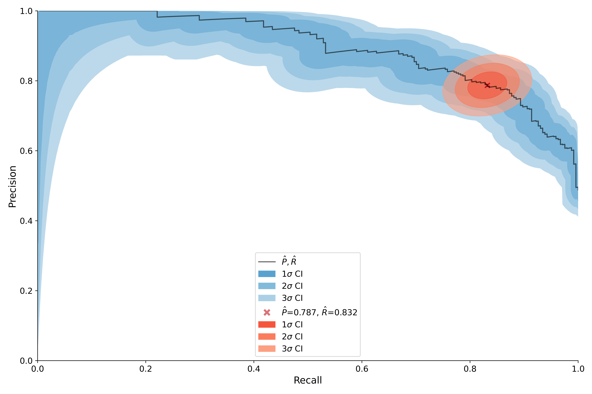

Basics
======

On a high level ``MMU`` provides two types of functionality:

* **Metrics** - functions to compute confusion matrix(ces) and binary classification metrics over classifier scores or predictions.
* **Uncertainty estimators** - functionality to compute the joint uncertainty over classification metrics.

.. note:: 
    
    See the `tutorial notebooks <https://github.com/RUrlus/ModelMetricUncertainty/tree/stable/notebooks>`_ for runnable examples. 
 
Confusion Matrix & Metrics
--------------------------

Metrics consist mainly of high-performance functions to compute the confusion matrix and metrics over a single test set, multiple classification thresholds and or multiple runs.

The ``binary_metrics`` functions compute the 10 most commonly used metrics:

- Negative precision aka Negative Predictive Value (NPV)
- Positive recision aka Positive Predictive Value (PPV)
- Negative recall aka True Negative Rate (TNR) aka Specificity
- Positive recall aka True Positive Rate (TPR) aka Sensitivity
- Negative f1 score
- Positive f1 score
- False Positive Rate (FPR)
- False Negative Rate (FNR)
- Accuracy
- Mathew's Correlation Coefficient (MCC)

Most other metrics should be computable from these.

See API section :ref:`Metrics` for all the function signatures.

.. code-block:: python3

    import mmu
    
    # we use generated data for this example
    scores, yhat, y = mmu.generate_data(n_samples=1000)
    
    # computing the confusion matrix from the classifier scores
    conf_mat = mmu.confusion_matrix(y, scores=scores)
     
    # from predictions this would be
    # conf_mat = mmu.confusion_matrix(y, yhat=yhat)
    
    # we can compute the binary metrics from the confusion matrix or directly
    metrics = mmu.binary_metrics_confusion_matrix(conf_mat)
    
    # or directly from the scores, here we also request the results to be
    dataframes
    conf_mat, metrics = mmu.binary_metrics(y, scores=scores, return_df=True)

Multiple thresholds
*******************

These functions can also be applied to multiple thresholds.
Say you want to compute the precision recall curve:

.. code-block:: python3

    import mmu
    
    # we use generated data for this example
    scores, yhat, y = mmu.generate_data(n_samples=1000)
    
    # determine the optimal classification thresholds
    thresholds = mmu.auto_thresholds(scores)

    # optionally we can limit the number of thresholds using ``max_steps``
    # thresholds = mmu.auto_thresholds(scores, max_steps=500)

    precision, recall = mmu.precision_recall_curve(y, scores, thresholds)
    
    # if you want the confusion matrices or full set of metrics
    conf_mats = mmu.confusion_matrices(y, scores=scores, thresholds=thresholds)
    metrics = mmu.binary_metrics_confusion_matrices(conf_mats)

    # or equivalently
    conf_mats, metrics = mmu.binary_metrics_thresholds(y, scores, thresholds)

Multiple test sets
******************

If you have multiple test sets MMU support this with ``runs`` postfix.
You can compute the metrics over runs for a single threshold or in combination
with thresholds.

.. code-block:: python3

    import mmu
    
    # we use generated data for this example
    # note that scores and y now have shape (1000, 30)
    scores, yhat, y = mmu.generate_data(n_samples=1000, n_sets=30)

    # the metrics over the runs but a single threshold
    metrics = mmu.binary_metrics_runs(y, scores=scores, threshold=0.5)
    
    # linearly spaced thresholds as auto_thresholds is not suited for multiple runs.
    thresholds = np.linspace(1e-12, 1-1e-12, 1000)

    # if you want the confusion matrices, note that in this case we
    # may need to set obs_axis. obs_axis should be zero if y and scores have the
    # observations beloning to a single set as rows, and 1 if they are stored in
    # over the columns
    conf_mats = mmu.confusion_matrices_runs_thresholds(
        y=y,
        scores=scores,
        thresholds=thresholds, 
        obs_axis=0
    )

    # alternatively
    conf_mats, metrics = mmu.binary_metrics_runs_thresholds(
        y=y,
        scores=scores,
        thresholds=thresholds,
    )

Estimators
----------

MMU currently only supports joint statistical uncertainty estimators for precision and recall. 
We are working on adding more estimators.

The estimators are classes that are instantiated from class methods, following
the scikit API.
The following class methods are provided:

- ``from_scores``
- ``from_predictions``
- ``from_confusion_matrix``
- ``from_classifier``

For example ``pr_err = mmu.PRU.from_scores(y, scores, threshold=0.82)``.

Precision-Recall
****************

MMU provides two methods for modelling the joint uncertainty on precision and recall: Multinomial uncertainty and Bivariate-Normal.

**Threshold vs curve uncertainty**

Both methods can be applied for a specific threshold or over the precision recall curve. The curve uncertainty represents a conservative view on the uncertainty.
The precision-recall grid is divided into, by default, 1000 bins per axis.
For each bin in the two dimensional grid we retain the minimum score, highest probability, over the thresholds. This means that for any threshold, the curve's CI will never be smaller than the CI of the corresponding threshold.
Hence, the curve uncertainty can slightly over-cover the true confidence interval.
To help with this the curve methods provide functionality to overlay threshold uncertainty(ies) on the curve. 

Multinomial approach
++++++++++++++++++++

The Multinomial approach computes the profile log-likelihoods scores for a grid around the precision and recall. The bounds of the grid are determined by ``n_sigmas`` times the standard deviation of the marginals. The scores are chi2 distributed with 2 degrees of freedom.

The Multinomial approach is usually robust for relatively low statistics tests.
Additionally it is valid for the extreme values of precision and recall, which the Bivariate-Normal approach is not. However, the Multinomial approach does not allow the statistical uncertainty of the train set to be incorporated which the Bivariate-Normal does.

The multinomial approach is the default approach.

.. code-block:: python3

    import mmu
    
    # we use generated data for this example
    # note that scores and y now have shape (1000, 30)
    scores, yhat, y = mmu.generate_data(n_samples=1000)

    # mmu.PRU is an alias
    pr_err = mmu.PrecisionRecallUncertainty.from_scores(y, scores, 0.85)

    # get the confusion matrix as a DataFrame
    pr_err.get_conf_mat()

    # plot the precision-recall joint uncertainty for 1, 2, and 3 standard deviations
    # i.e. the approximately 68%, 95% and 99% CIs
    pr_err.plot()

You can also compute and plot the uncertainty over precision-recall curve, here
we overlay the threshold uncertainty computed above.
Note that we don't specify the threshold in this case. If ``thresholds`` is None
we compute them with :func:`mmu.auto_thresholds`.

.. code-block:: python3

    # PRCU is an alias of PrecisionRecallCurveUncertainty
    pr_err_curve = mmu.PRCU.from_scores(y, scores)

    # we add the threshold uncertainty using point_uncertainty argument
    ax = pr_err.plot(point_uncertainty=pr_err)

See :class:`mmu.PrecisionRecallUncertainty` for details.

Bivariate-Normal approach
+++++++++++++++++++++++++

The statistical/sampling uncertainty over the Precision and Recall are modelled
as a Bivariate-Normal over the linearly propagated errors of the confusion
matrix. For a threshold/confusion matrix a covariance matrix is computed which is used to determine the elliptical uncertainty.
The curve uncertainty computes chi2 scores in a similar manner to Multinomial approach.

Note that the Bivariate-Normal (Elliptical) approach is only valid for medium to high statistic datasets. A warning is raised when the Normal approximation to the Binomial may not be valid. Additionally, the estimation is not valid for the extremes of precision/recall. However, the train set uncertainty can be added to the test uncertainty.

The bivariate threshold/point uncertainty can be computed using setting
``method`` to one of: ``'bivariate'``, ``'bvn'`` or , ``'elliptical'``.

.. code-block:: python3

    import mmu
    
    # we use generated data for this example
    scores, yhat, y = mmu.generate_data(n_samples=1000)

    # mmu.PRU is an alias
    pr_err = mmu.PrecisionRecallUncertainty.from_scores(y, scores, 0.85, method='bvn')

    # PRCU is an alias of PrecisionRecallCurveUncertainty
    pr_err_curve = mmu.PRCU.from_scores(y, scores, method='bvn')

See :class:`mmu.PrecisionRecallUncertainty` for details.

Comparing two precision-recall scores
+++++++++++++++++++++++++++++++++++++

If you want to compare two models for a given threshold you can evaluate the chi2 score of one relative to the other.
For both methods we can compute the Chi2 score for a precision, recall using the ``compute_score_for``:

.. code-block:: python3

    import mmu
    
    # we use generated data for this example
    scores, yhat, y = mmu.generate_data(n_samples=1000)
    scores_alt, yhat_alt, y_alt = mmu.generate_data(n_samples=1000)

    # mmu.PRU is an alias
    pr_err = mmu.PrecisionRecallUncertainty.from_scores(y, scores, 0.85)
    pr_err_alt = mmu.PRU.from_scores(y_alt, scores_alt, 0.85)
    chi2_score = pr_err.compute_score_for(pr_err_alt.precision, pr_err_alt.recall)

This score can than be used for further statistical tests or one can compute the p-value directly using:

.. code-block:: python3

    import mmu
    
    # we use generated data for this example
    scores, yhat, y = mmu.generate_data(n_samples=1000)
    scores_alt, yhat_alt, y_alt = mmu.generate_data(n_samples=1000)

    # mmu.PRU is an alias
    pr_err = mmu.PrecisionRecallUncertainty.from_scores(y, scores, 0.85)
    pr_err_alt = mmu.PRU.from_scores(y_alt, scores_alt, 0.85)
    p-value = pr_err.compute_pvalue_for(pr_err_alt.precision, pr_err_alt.recall)

``compute_score_for`` and ``compute_pvalue_for`` can be used to compute scores/p-values for a single precision, recall or arrays of precisions and recalls.
See :class:`mmu.PrecisionRecallUncertainty` for details.
